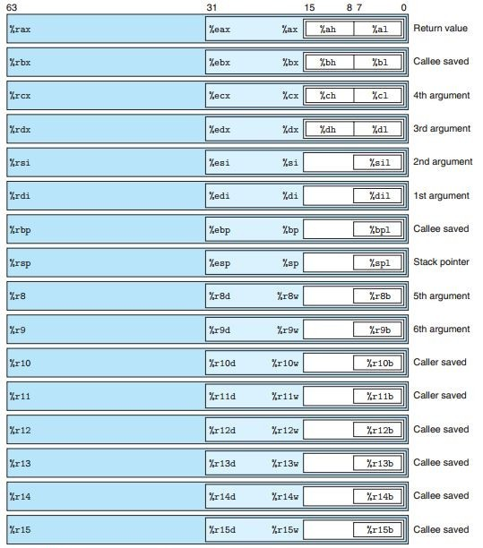

# 组成原理_指令系统

## x86 CPU 寄存器

### 16 位 CPU 寄存器

* 8 个通用寄存器
  
  * 数据寄存器（由两个 8 位寄存器组成，高 8 位 _H，低 8 位 _L）
  
    * AX (accumulator)：累加器，常用于算术操作，分为 AH 和 AL。
    * BX (base)：基地址寄存器，分为 BH 和 BL。
    * CX (count)：计数器，常用于循环和移位操作，分为 CH 和 CL。
    * DX (data)：数据寄存器，分为 DH 和 DL。
  
  * 指针寄存器 
    
    * 堆栈指针 SP：堆栈偏移地址，用于访问栈顶。
    * 基址指针 BP：常用作高级语言中引用栈上的函数和变量。
  
  * 变址寄存器 
    
    * 源地址 SI
    * 目的地址 DI

* 4 个段寄存器
  
  * 代码段 CS：代码段地址
  * 数据段 DS
  * 堆栈区 SS：堆栈区地址
  * 附加段 ES

* 2 个控制寄存器
  
  * 指令指针 IP：代码偏移地址
  * 标志寄存器 FLAGS：
 
以上所有的寄存器都是 16 位的。

### 32 位 CPU 寄存器

32 位 CPU 寄存器在 16 位的基础上进行了扩展（Extend）：

* 8 个 32 位通用寄存器 EAX、EBX、ECX、EDX、ESP、EBP、ESI、EDI。（16 位前面加个 E）

* 6 个 16 位段寄存器：ECS、EDS、ESS、EES，以及新增的附加段寄存器 EFS、EGS。

* 2 个 32 位控制寄存器：EIP、EFLAGS。

### 64 位 CPU 寄存器

* 16 个通用寄存器：



## x86 汇编指令

AT&T 汇编：

Intel 汇编：

## 寻址方式

* 立即寻址：

(EA) = A

```asm
mov    eax, number
```

* 直接寻址：

EA = A

```asm
mov    eax, [a]
```

* 间接寻址：

EA = (A)

```asm
mov    eax, @address
```

* 寄存器寻址：

EA = R<sub>i</sub>

```asm
mov    eax, ecx
```

* 寄存器间接寻址：

EA = (R<sub>i</sub>)

```asm
mov    eax, [ebx]
```

* 相对寻址：

EA = (PC) + A

```asm
mov    eax, [esi + address]
```

* 变址寻址：

EA = (IX) + A

* 基址寻址：

EA = (BR) + A

* 堆栈寻址：

* 复合寻址：

    * 变址 + 间址：EA = ((IX) + A)
    * 间址 + 变址：EA = (IX) + (A)
    * 相对 + 间址：EA = ((PC) + A)

## 高级语言的机器级表示

### 运算

### 控制语句

### 程序运行时栈

## CISC 和 RISC 的基本概念
